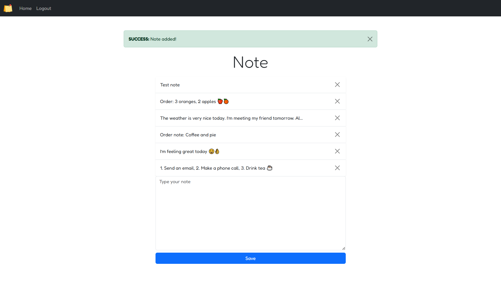

# Flask Project 📜

A Flask-based web application designed for note-taking and organization. It is built to provide users with a clean and intuitive interface for managing their notes efficiently.  

[](https://www.python.org/)  
[](https://flask.palletsprojects.com/)  

---

## 🚀 Features
- **User Authentication**: Register, Login, and Logout functionality for personalized access.
- **Note Management**: Add, view, and delete notes seamlessly.
- **Interactive UI**: Responsive and clean design using Bootstrap.
- **Real-time Actions**: Leverages AJAX for dynamic updates without reloading the page.

---

## 🛠️ Technologies Used
- **Backend**: Flask, Flask-Login
- **Frontend**: HTML, CSS, Bootstrap, jQuery
- **Database**: SQLite (or upgradeable to PostgreSQL/MySQL)
- **Version Control**: Git & GitHub

---

## 🧰 Installation Guide

### 1. Clone the Repository
```bash
git clone https://github.com/whdev36/flask-project.git
cd flask-project
```

### 2. Create a Virtual Environment
```bash
python3 -m venv venv
source venv/bin/activate  # On Windows: venv\Scripts\activate
```

### 3. Install Dependencies
```bash
pip install -r requirements.txt
```

### 4. Set Up the Database
Initialize the database using Flask's built-in CLI:
```bash
flask db init
flask db migrate
flask db upgrade
```

### 5. Run the Application
```bash
flask run
```
The app will be available at `http://127.0.0.1:5000`.

---

## 📸 Screenshots
  
_Add a screenshot of your homepage or key features._

---

## 🔗 Demo
_If hosted, include the live link here._

---

## 📝 Icon Credits
Icons used in this project are created by [Pixel perfect - Flaticon](https://www.flaticon.com/free-icons/paper).

---

## 🤝 Contributing
1. Fork the repository.
2. Create a new branch for your feature: `git checkout -b feature-name`.
3. Commit your changes: `git commit -m 'Add some feature'`.
4. Push to the branch: `git push origin feature-name`.
5. Create a pull request.

---

## 🛡️ License
This project is licensed under the MIT License. See the LICENSE file for details.

---

## 👤 Author
**Wisdom Hunter**  
For any inquiries or feedback, feel free to contact me at:  
- **GitHub**: [whdev36](https://github.com/whdev36)  
- **Email**: diyorbekqodirboyev@gmail.com 

Happy coding! 🚀
